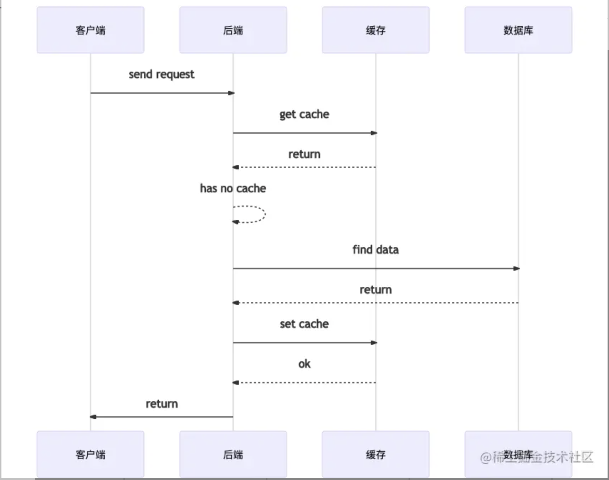
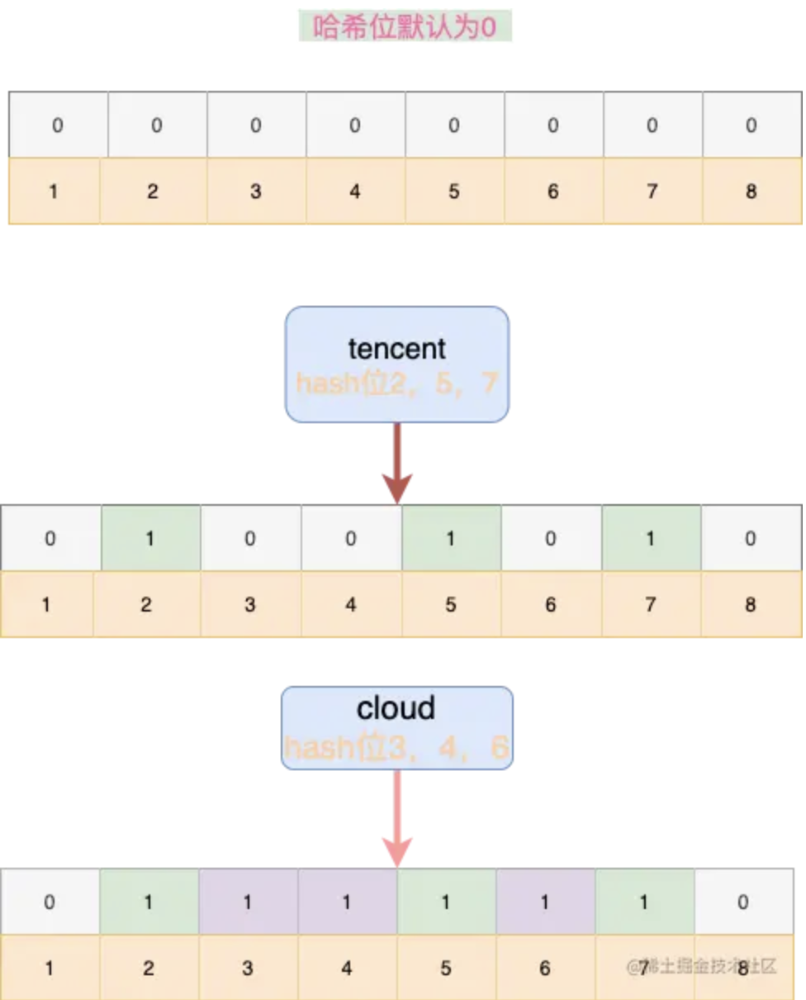

<!--markdown-->## 背景

在高并发请求时，业务数据一般会对数据进行缓存，提高系统并发量，因为磁盘IO和网络IO相对于内存IO的成百上千倍的性能劣势。 做个简单计算，如果我们需要某个数据，该数据从数据库磁盘读出来需要0.1s，从交换机传过来需要0.05s，那么每个请求完成最少0.15s（当然，事实上磁盘和网络IO也没有这么慢，这里只是举例），该数据库服务器每秒只能响应67个请求；而如果该数据存在于本机内存里，读出来只需要10us，那么每秒钟能够响应100，000个请求。 通过将高频使用的数据存在离cpu更近的位置，以减少数据传输时间，从而提高处理效率，这就是缓存的意义。

但是在上文中提到过，缓存会存在击穿，穿透等问题，对于此我们可以引入Bloom Filter (布隆过滤器)，防止数据库压力过大导致系统异常。

## Bloom Filter

如果想要判断一个元素是不是在一个集合里，一般想到的是将所有元素保存起来，然后通过比较确定。 链表，树等等数据结构都是这种思路. 但是随着集合中元素的增加，我们需要的存储空间越来越大， 检索速度也越来越慢(O(n),O(logn))。

不过还有一种叫作散列表(又叫哈希表，Hash table)的数据结构，它可以通过一个Hash函数将一个 元素映射成一个位阵列中的一个点，这样一来，我们只要看看这个点是不是1就可以知道集合中有没有它了。 这就是布隆过滤器的基本思想。

布隆过滤器（Bloom Filter） 是 1970 年由布隆提出的。它 实际上 是一个很长的二进制向量和一系列 随机映射函数 ，实际上你也可以把它简单理解为一个不怎么精确的 set 结构，当你使用它的 contains 方法判断某个对象是否存在时，它可能会误判。但是布隆过滤器也不是特别不精确，只要参数设置的合理， 它的精确度可以控制的相对足够精确，只会有小小的误判概率。

当布隆过滤器说某个值存在时，这个值 可能不存在；当它说不存在时，那么 一定不存在。打个比方，当它说 不认识你时，那就是真的不认识，但是当它说认识你的时候，可能是因为你长得像它认识的另外一个朋友 (脸长 得有些相似)，所以误判认识你。
## 原理

**当一个元素加入布隆过滤器中的时候，会进行如下操作：**

1. 使用布隆过滤器中的哈希函数对元素值进行计算，得到哈希值（有几个哈希函数得到几个哈希值）。
2. 根据得到的哈希值，在位数组中把对应下标的值置为 1。

**当我们需要判断一个元素是否存在于布隆过滤器的时候，会进行如下操作：**

1. 对给定元素再次进行相同的哈希计算；
2. 得到值之后判断位数组中的每个元素是否都为 1，如果值都为 1，那么说明这个值在布隆过滤器中， 如果存在一个值不为 1，说明该元素不在布隆过滤器中。

如上图，

1. 有8个hash位，且默认值为0，
2. 当对`tencent`进行散列hash之后，2，5，7位被置为1，
3. 继续对`cloud`进行散列hash后，3，4，6位被置为1。
4. 这时候我们再对其它词汇`other`进行hash，假设散列为1、2、3，1位为0，可以判断该单词不存在集合中。
汇总流程

## 如何选择哈希函数个数和布隆过滤器长度

如果布隆过滤器的长度太小，所有的 bit 位很快就会被用完，此时任何查询都会返回“可能存在”； 如果布隆过滤器的长度太大，那么误判的概率会很小，但是内存空间浪费严重。 类似的，哈希函数的个数越多，则布隆过滤器的 bit 位被占用的速度越快；哈希函数的个数越少， 则误判的概率又会上升。因此，布隆过滤器的长度和哈希函数的个数需要根据业务场景来权衡。

**三个参数**

- 哈希函数的个数k；
- 布隆过滤器位数组的容量m;
- 布隆过滤器插入的数据数量n;

关于三个值的设定，有位大佬十年前的文章已经做了总结，需要深厚的数学功底，这里不再详细赘述。 文章链接是`http://blog.csdn.net/jiaomeng/article/details/1495500`

主要的数学结论有：

- 为了获得最优的准确率，当k \= ln2 \* (m/n)时，布隆过滤器获得最优的准确性；

## 优缺点
优点：优点很明显，二进制组成的数组，占用内存极少，并且插入和查询速度都足够快。

缺点：随着数据的增加，误判率会增加；还有无法判断数据一定存在；另外还有一个重要缺点，无法删除数据

## 场景

- 大数据判断是否存在：这就可以实现出上述的去重功能，如果你的服务器内存足够大的话，那么使用 HashMap 可 能是一个不错的解决方案，理论上时间复杂度可以达到 O(1)的级别，但是当数据量起来之后，还是只能考虑布隆过滤器。
- 解决缓存穿透(背景中提到的问题)：利用布隆过滤器我们可以预先把数据查询的主键，比如用户 ID 或文章 ID 缓存到过滤器中。当根据 ID 进行数据查询的时候，我们先判断该 ID 是否存在，若存在的话，则进行下一步处 理。若不存在的话，直接返回，这样就不会触发后续的数据库查询。需要注意的是缓存穿透不能完全解决，我们只 能将其控制在一个可以容忍的范围内。
- 爬虫/ 邮箱等系统的过滤：平时不知道你有没有注意到有一些正常的邮件也会被放进垃圾邮件目录中，这就是使用布隆过滤器 误判 导致的。
- Google Chrome 使用布隆过滤器识别恶意 URL。

## 基本操作

布隆过滤器有两个基本指令，`bf.add` 添加元素，`bf.exists` 查询元素是否存在， 它的用法和 `set` 集合的 `sadd` 和 `sismember` 差不多。注意 `bf.add` 只能一次添加一个元素， 如果想要一次添加多个，就需要用到 `bf.madd` 指令。同样如果需要一次查询多个元素是否存在， 就需要用到 `bf.mexists` 指令。
```bash
127.0.0.1:6379> bf.reserve users 0.01 1000
OK
127.0.0.1:6379> bf.add users u1
(integer) 1
127.0.0.1:6379> bf.add users u2
(integer) 1
127.0.0.1:6379> bf.add users u3
(integer) 1
127.0.0.1:6379> bf.exists users u3
(integer) 1
127.0.0.1:6379> bf.madd users user4 user5 user6
1) (integer) 1
2) (integer) 1
3) (integer) 1
127.0.0.1:6379> bf.mexists users user4 user5 user6 user7
1) (integer) 1
2) (integer) 1
3) (integer) 1
4) (integer) 0
```

`bf.reserve` 有三个参数，分别是 key、error\_rate (错误率) 和 initial\_size：

**error_rate** 越低，需要的空间越大，对于不需要过于精确的场合，设置稍大一些也没有关系， 比如上面说的推送系统，只会让一小部分的内容被过滤掉，整体的观看体验还是不会受到很大影响的；

**initial_size** 表示预计放入的元素数量，当实际数量超过这个值时，误判率就会提升，所以需要 提前设置一个较大的数值避免超出导致误判率升高；

如果不适用 bf.reserve，默认的 `error_rate` 是 `0.01`，默认的 `initial_size` 是 `100`。