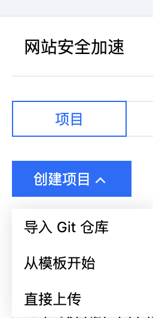
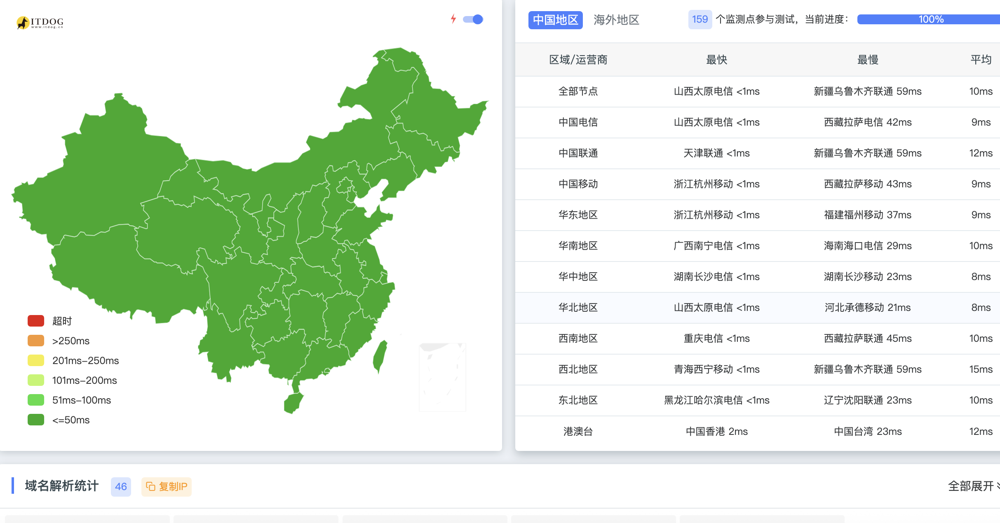
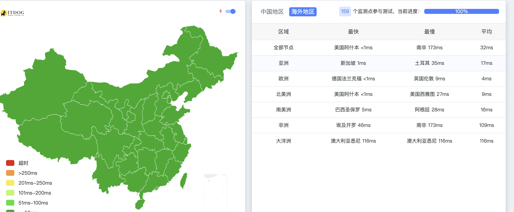

<!--markdown-->
1、打开官网地址https://console.cloud.tencent.com/edgeone/pages
2、创建项目

3、上传项目
我是使用直接上传的文件，直接上传dist文件里面的东西，然后直接压缩上传
4、等待部署
等部署成功、然后配置域名和证书即可，中国大陆地区只能是备案才能正常访问
5、效果
实例地址
https://curl.bgspider.com/
https://tools.bgspider.com/
基本上都是绿色的

