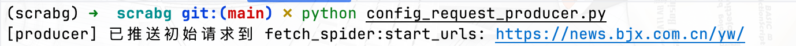
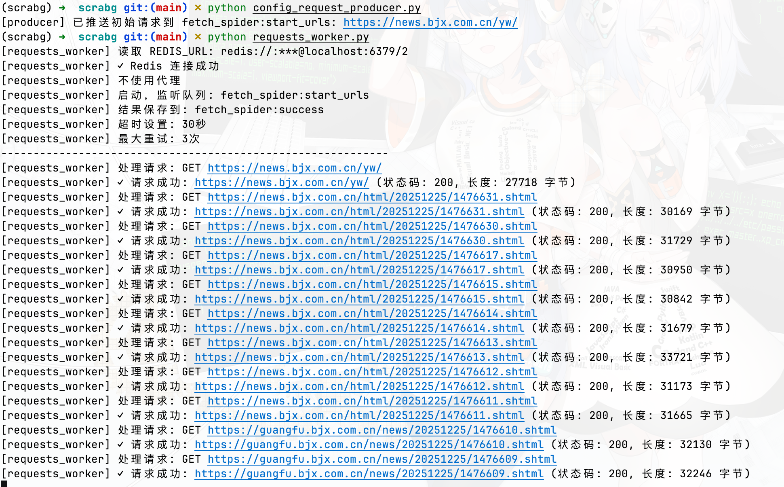
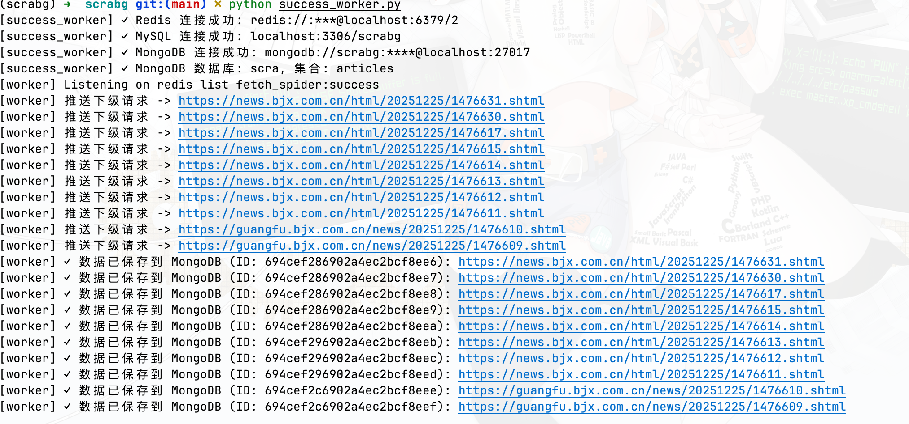
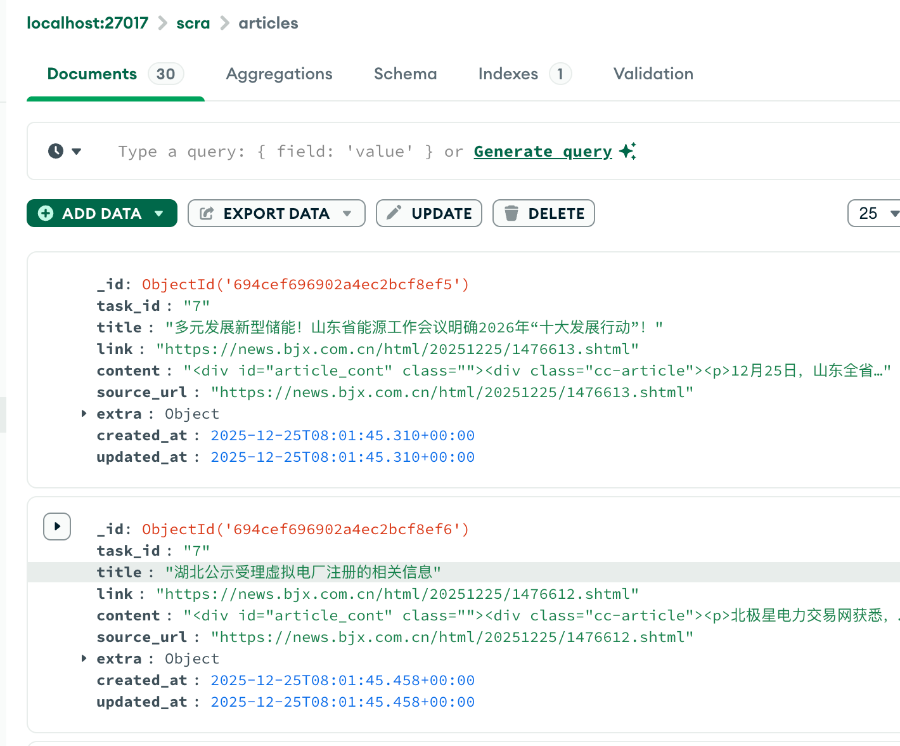
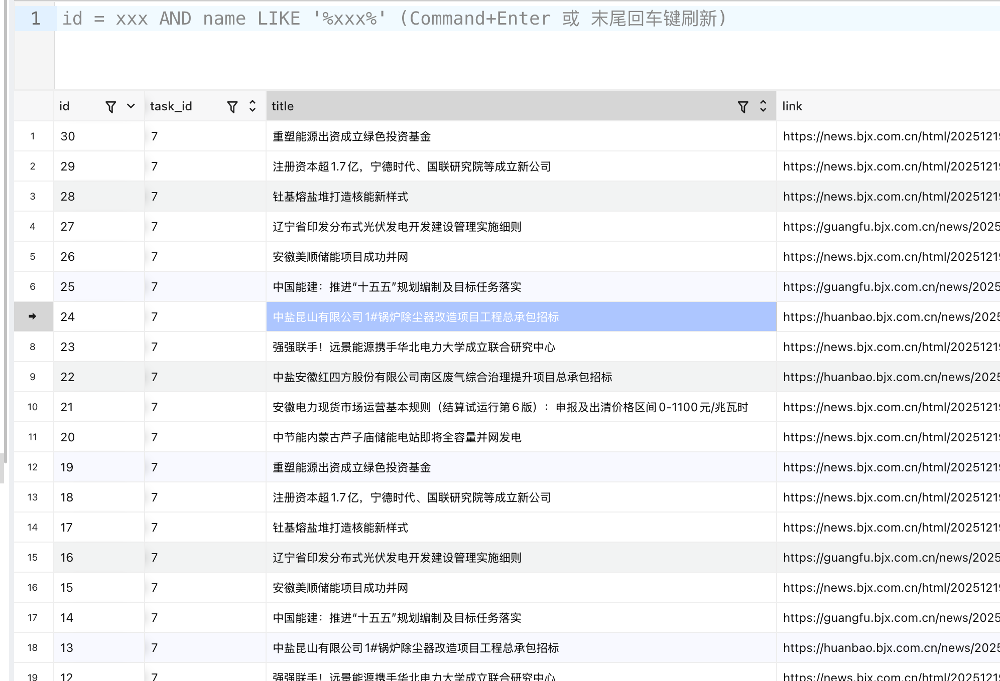
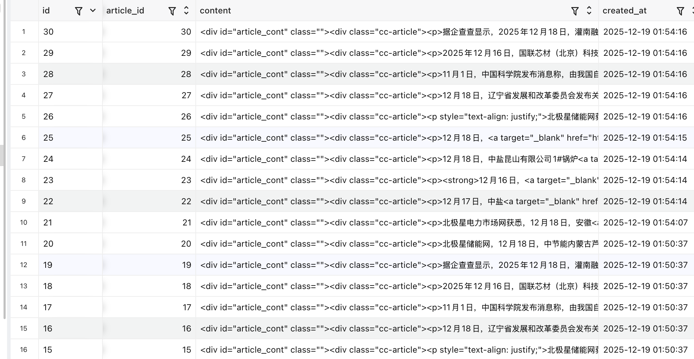
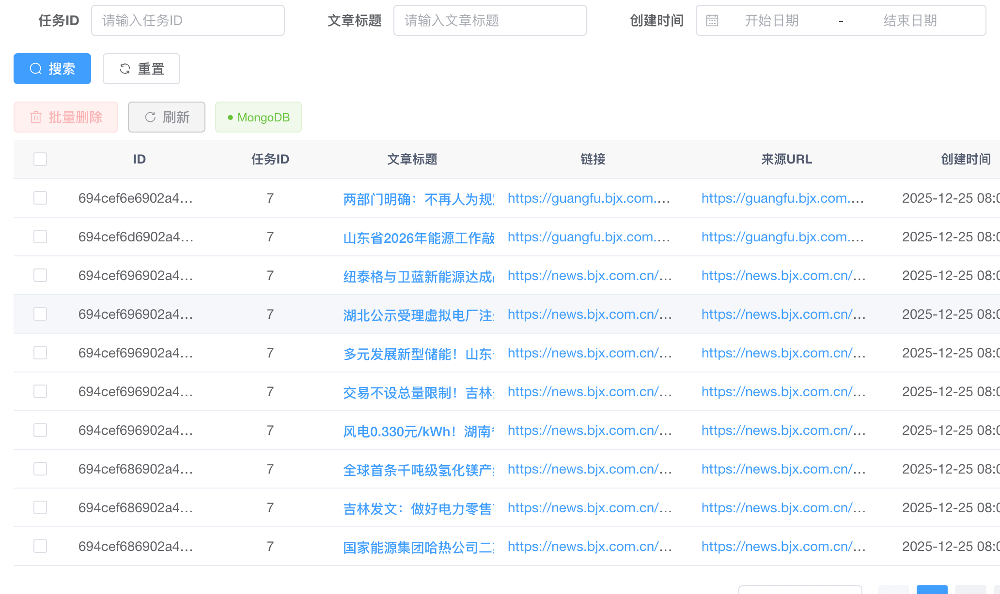
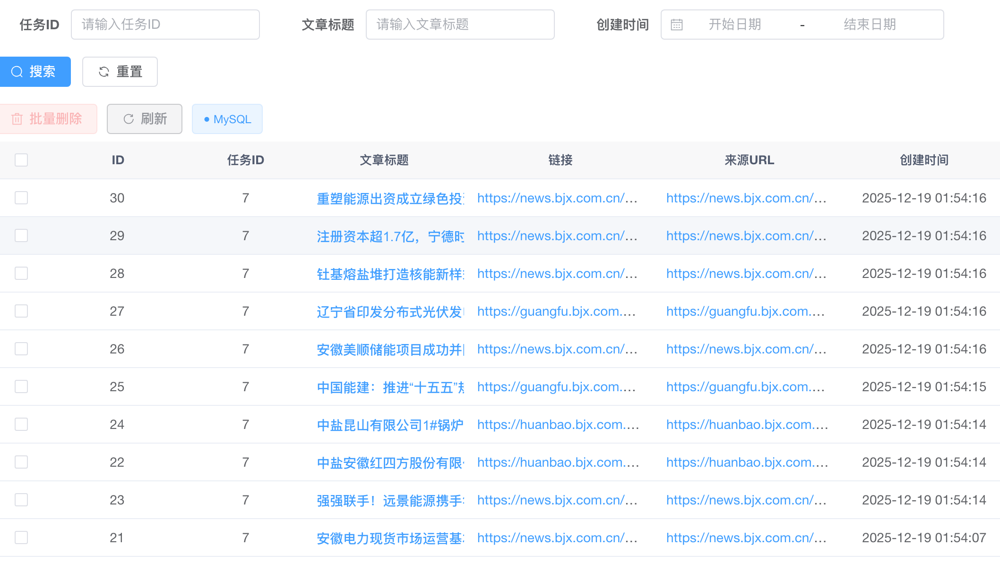

# scrabg初体验二(完整流程版本)

步骤开始前默认已经好mysql、redis、mongo数据库

### 1.创建项目环境

```python
git clone https://github.com/bgspiders/scrabg.git
cp .env.example .env   根据需求修改里面的数据库信息，存储配置MongoDB，那就是Mongodb不配置代表是mysql
激活虚拟环境,使用自带的venv或者conda都可以，下面使用venv创建
python3 -m venv venv
source venv/bin/activate
```

### 2. 安装依赖

```bash
pip install -r requirements.txt
```

#### 3. 测试推送任务到 Redis

```bash
source scrabgs/bin/activate
# 确保 MySQL 中有测试数据
 python config_request_producer.py

# 检查 Redis 队列
redis-cli LLEN fetch_spider:start_urls
```

示例图片

‍

#### 4. 测试爬虫运行

```bash
source scrabgs/bin/activate

# 测试 fetch_spider（从 Redis 消费）
scrapy crawl fetch_spider -L INFO
#使用requests队列
python requests_worker.py
```

示例图片 

#### 5. 测试解析节点

```bash
source scrabgs/bin/activate
#使用requests队列
python success_worker.py
```

示例图片 

#### 6. 验证数据保存

```sql
-- 检查 articles 表中的数据
SELECT * FROM articles ORDER BY created_at DESC LIMIT 10;

-- 检查成功队列中的数据（需要从 Redis 读取）
redis-cli LRANGE fetch_spider:success 0 9
在数据库中查看数据mysql中是articles，mongodb中是items
```

mongo是整体保存，mysql分表保存  
mongo数据库截图  
​  
mysql数据库截图-列表  
​  
mysql数据库截图-详情  
​

### 7. 前端保存结果界面

界面截图，可以进行查询，点击可以查看详情  
mongo数据库截图  
​  
mysql版本  
​

### 8 分布式启动

可以在多台服务器启动请求和解析节点，根据自己需求启动
