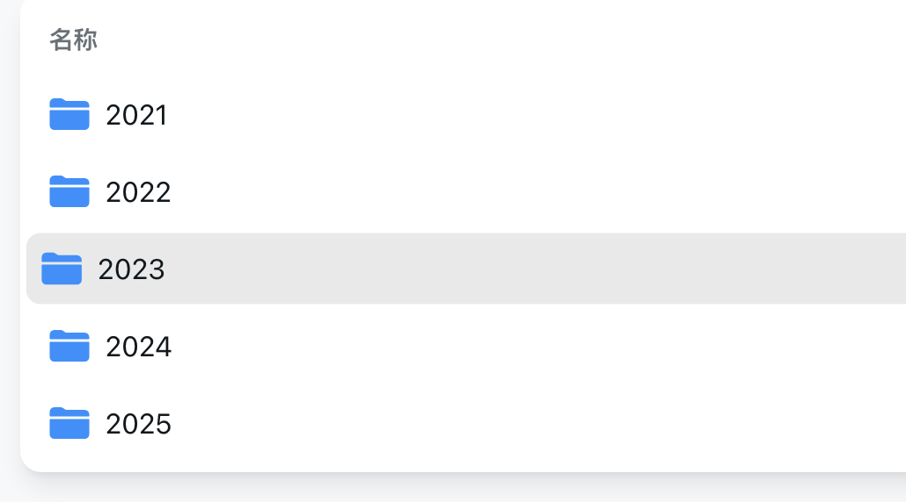
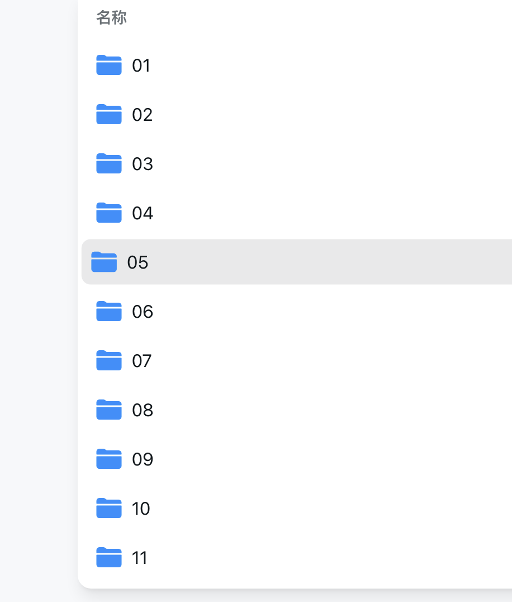
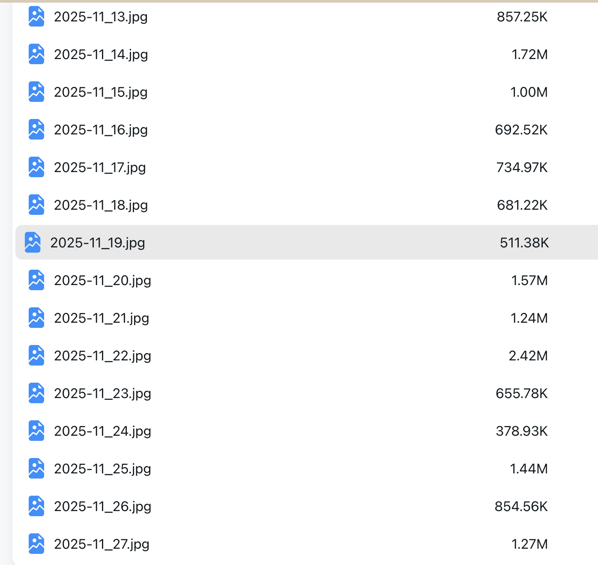

<!--markdown-->
直接上源码
```
# -*- coding: utf-8 -*-  
import os
import re
import requests
from urllib.parse import urlparse
from concurrent.futures import ThreadPoolExecutor


def download_image(url, output_dir, ym, idx):
    """  
    下载单个图片并保存到指定文件夹中，按照年/月的结构组织。  
    """
    print(f"正在下载第 {idx} 张图片：{url}")
    try:
        response = requests.get(url, stream=True, timeout=10)
        if response.status_code == 200:
            # 获取文件扩展名  
            parsed_url = urlparse(url)
            ext = os.path.splitext(parsed_url.path)[1]
            if not ext:
                ext = ".jpg"  # 默认使用 jpg 扩展名  

            # 解析年月信息创建目录结构
            year, month = ym.split('-')
            year_month_dir = os.path.join(output_dir, year, month)

            # 创建年/月层级目录
            os.makedirs(year_month_dir, exist_ok=True)

            # 图片保存的路径和文件名 (格式: YYYY-MM_DD.ext)
            filename = f"{ym}_{idx:02d}{ext}"
            filepath = os.path.join(year_month_dir, filename)

            # 保存图片到文件  
            with open(filepath, "wb") as f:
                for chunk in response.iter_content(chunk_size=1024):
                    if chunk:
                        f.write(chunk)
            print(f"保存到：{filepath}")
        else:
            print(f"下载失败，状态码：{response.status_code}")
    except Exception as e:
        print(f"下载图片时出现错误：{e}")


def get_url(md_file, output_dir, ym):
    # 读取 md 文件内容  
    with open(md_file, "r", encoding="utf-8") as f:
        content = f.read()  # 使用正则表达式提取图片链接  
    pattern = r'\[download 4k\]\((.*?)\)'
    urls = re.findall(pattern, content)
    print(f"在 {md_file} 中找到 {len(urls)} 个图片链接。")

    # 创建图片存储文件夹（如果不存在）  
    os.makedirs(output_dir, exist_ok=True)

    # 使用线程池下载每个图片  
    with ThreadPoolExecutor() as executor:
        for idx, url in enumerate(urls, start=1):
            executor.submit(download_image, url, output_dir, ym, idx)


def main(root_dir, output_dir):
    """  
    遍历根目录下的所有子文件夹，查找 README.md 文件并下载图片。  
    """
    # 遍历根目录下的所有子文件夹  
    for root, dirs, files in os.walk(root_dir):
        for file in files:
            if file == "README.md":
                # 获取年月信息（文件夹名即为年月）  
                folder_name = os.path.basename(root)
                # 确保文件夹名称是有效的年月格式  
                if re.match(r'^\d{4}-\d{2}$', folder_name):
                    md_file_path = os.path.join(root, file)
                    print(f"正在处理 {md_file_path} ...")
                    # 下载该目录下的所有图片  
                    get_url(md_file_path, output_dir, folder_name)


if __name__ == "__main__":
    # 根目录路径（wallpaper 文件夹路径）  
    wallpaper_dir = "./bing-wallpaper/picture"
    # 指定图片保存的输出文件夹  
    output_directory = "./wallpaper"
    # 遍历并下载所有图片  
    main(wallpaper_dir, output_directory)
```
## 最终效果
年份

月份


原始代码来源：https://zhuanlan.zhihu.com/p/25972026050
只修改保存文件夹位置，已经下载好的文件，可以在线看
https://cloud.bgspider.com/
## 使用方法
复制这个代码，将其保存下来成down_bing.py
安装好requests库，
`pip install requests`
下载这个项目
`git clone https://github.com/niumoo/bing-wallpaper`
运行刚保存的文件
`python3 down_bing.py` 然后等着程序运行技术即可